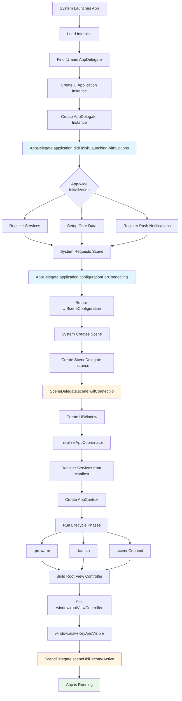
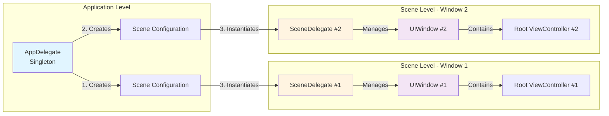
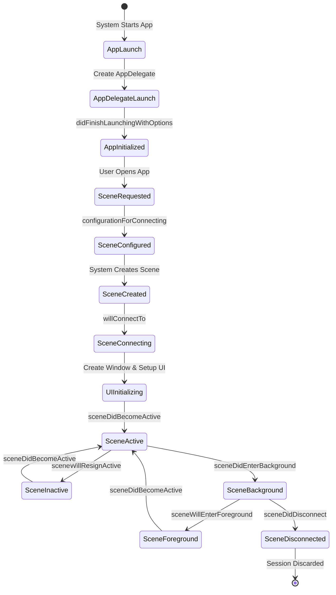
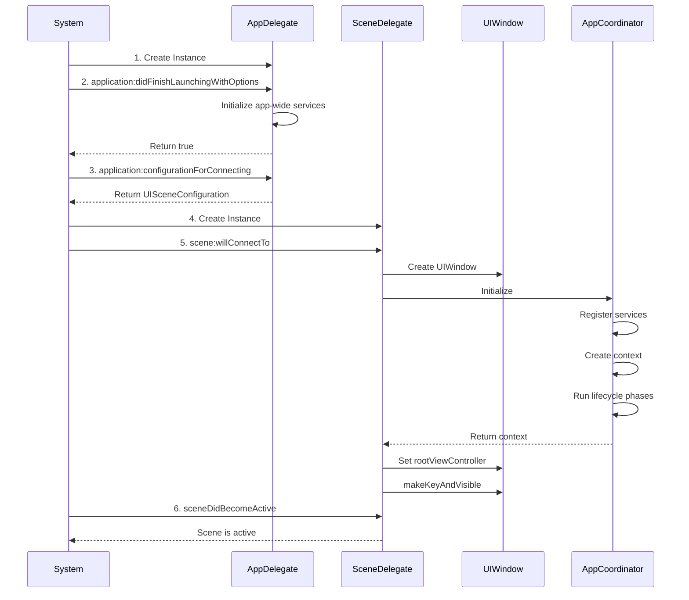
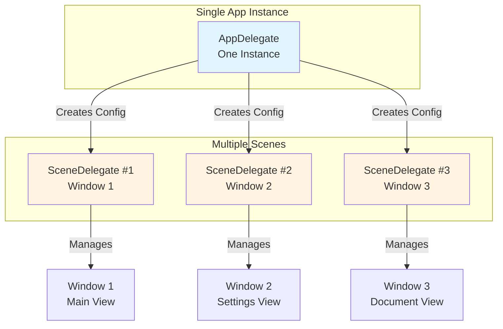
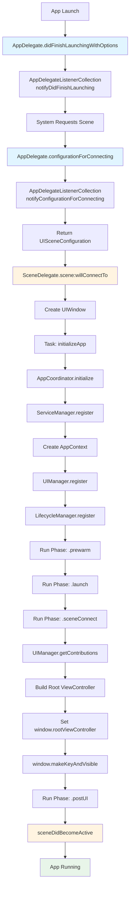

# AppDelegate & SceneDelegate: Visual Diagrams

## Diagram 1: Complete App Startup Flow



## Diagram 2: Relationship Between AppDelegate and SceneDelegate



## Diagram 3: Lifecycle Events Flow



## Diagram 4: Method Call Sequence



## Diagram 5: Multi-Window Scenario (iPad)



## Diagram 6: Your Ghost App Specific Flow



## ASCII Art Diagram: Simple Flow

```
┌─────────────────────────────────────────────────────────────────────┐
│                         iOS APP STARTUP                             │
└─────────────────────────────────────────────────────────────────────┘

1. SYSTEM LAUNCH
   │
   └─► Load Info.plist
       └─► Find @main AppDelegate class
           └─► Create UIApplication instance
               │
               ▼
2. APPDELEGATE CREATION
   │
   └─► application(_:didFinishLaunchingWithOptions:)
       │
       ├─► Initialize app-wide services
       ├─► Register push notifications
       ├─► Setup Core Data
       └─► Configure analytics
           │
           ▼
3. SCENE CONFIGURATION
   │
   └─► application(_:configurationForConnecting:options:)
       │
       └─► Return UISceneConfiguration
           │
           └─► Specifies SceneDelegate class name
               │
               ▼
4. SCENE CREATION
   │
   └─► System creates UIScene
       │
       └─► System creates SceneDelegate instance
           │
           ▼
5. SCENE CONNECTION
   │
   └─► scene(_:willConnectTo:options:)
       │
       ├─► Create UIWindow
       ├─► Set windowScene
       └─► Start async initialization
           │
           ▼
6. UI INITIALIZATION (Your Ghost App)
   │
   ├─► Initialize AppCoordinator
   ├─► Register services from AppManifest
   ├─► Create AppContext
   ├─► Run lifecycle phases:
   │   ├─► .prewarm
   │   ├─► .launch
   │   ├─► .sceneConnect
   │   └─► .postUI
   ├─► Get UI contributions
   ├─► Build root view controller
   ├─► Set window.rootViewController
   └─► window.makeKeyAndVisible()
       │
       ▼
7. SCENE ACTIVE
   │
   └─► sceneDidBecomeActive(_:)
       │
       └─► App is now visible and running
           │
           ▼
8. LIFECYCLE EVENTS (Ongoing)
   │
   ├─► sceneWillResignActive(_:)    ← Temporary interruption
   ├─► sceneDidBecomeActive(_:)     ← Resume
   ├─► sceneWillEnterForeground(_:) ← Returning from background
   ├─► sceneDidEnterBackground(_:)  ← Going to background
   └─► sceneDidDisconnect(_:)      ← Scene disconnected
       │
       └─► AppDelegate.application(_:didDiscardSceneSessions:)
           └─► Session permanently discarded
```

## Key Points Visualization

```
┌─────────────────────────────────────────────────────────────┐
│                    RESPONSIBILITY MATRIX                    │
├─────────────────────────────────────────────────────────────┤
│                                                             │
│  AppDelegate (App-Wide)          SceneDelegate (Scene-Wide) │
│  ──────────────────────          ─────────────────────────  │
│                                                             │
│  ✓ App launch                  ✓ Window creation           │
│  ✓ Scene configuration         ✓ UI setup                  │
│  ✓ Push notifications          ✓ Root view controller      │
│  ✓ Background tasks            ✓ Scene lifecycle          │
│  ✓ Core Data stack             ✓ Scene state               │
│  ✓ Shared services             ✓ Window-specific resources │
│  ✓ App-wide state              ✓ Scene restoration         │
│                                                             │
│  ONE instance per app          ONE instance per scene       │
│                                                             │
└─────────────────────────────────────────────────────────────┘
```

## Timeline View

```
Time →
│
├─► [AppDelegate] didFinishLaunchingWithOptions
│   └─► App-wide initialization
│
├─► [AppDelegate] configurationForConnecting
│   └─► Scene configuration created
│
├─► [SceneDelegate] scene:willConnectTo
│   └─► Window created, UI initialization starts
│
├─► [AppCoordinator] Initialize
│   ├─► Services registered
│   ├─► Context created
│   └─► Lifecycle phases run
│
├─► [SceneDelegate] UI Setup Complete
│   └─► Window made visible
│
├─► [SceneDelegate] sceneDidBecomeActive
│   └─► Scene is active
│
└─► [Ongoing] Scene lifecycle events
    ├─► sceneWillResignActive
    ├─► sceneDidBecomeActive
    ├─► sceneWillEnterForeground
    ├─► sceneDidEnterBackground
    └─► sceneDidDisconnect
```

---

## How to View These Diagrams

1. **Mermaid Diagrams**: 
   - View in GitHub (renders automatically)
   - Use [Mermaid Live Editor](https://mermaid.live/)
   - Use VS Code with Mermaid extension
   - Use Markdown viewers that support Mermaid

2. **ASCII Diagrams**: 
   - View directly in any text editor
   - Works in terminal/console
   - Compatible with all markdown viewers


